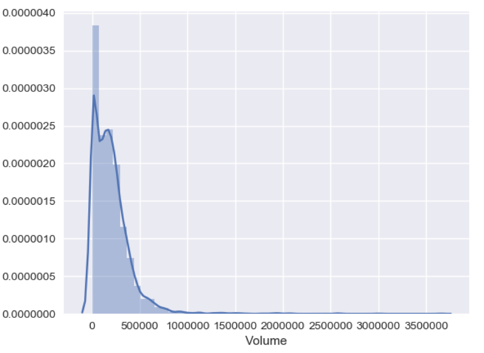
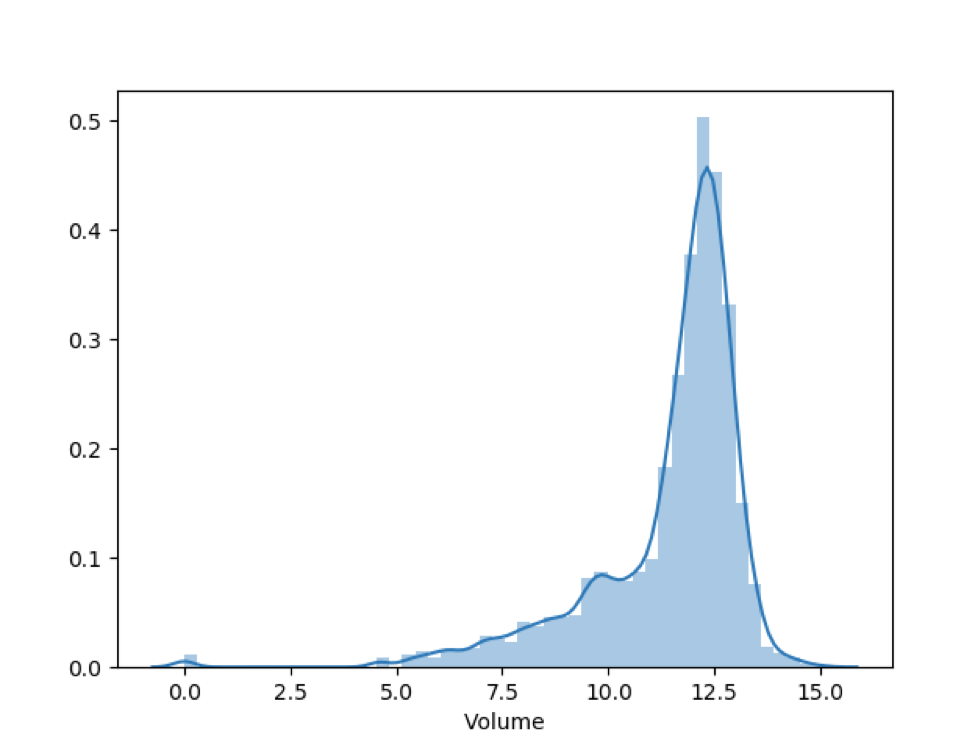
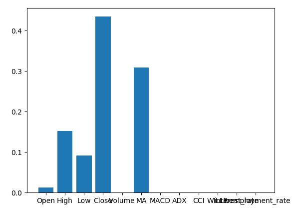

# Predicting Adjusted Close Stock Prices

Hongqiao Li

Udacity Machine Learning Nanodegree Capstone Project

# 1. Introduction:

In recent years, the machine learning becomes a very important technique which can be used in many areas, such as driving, searching, and economic area. This project will focus on how to use the machine learning techniques to predict the adjusted close price for a stock, VGT.

VGT (Vanguard Information Technology) is an ETF contains stocks in technique area. The stock price will be affected by many factors. Such as unemployment rate and interests. Since the stock is also a time series data, it is also important for us to invoke the stock indicators to get time series information.

In this study, I try to predict today's adjusted close price.
The features I analyzed in this project are:
a.the stock information(Open price, Close price etc), 
b.indicators(time series information) 
c.unemployment rate and interest rate.

I will also analyze the models including Lasso, Ridge, DecisionTreeRegressor, and RandomForestRegressor.
# 2. Datasets:
Stock price data[1]:
This dataset contains the historic market stock VGT data from 1/30/2004 to 12/13/2017. 

The data contains the following seven fields:
Date, the date information.
Open, the stock price at the opening of the stock market
High, the highest stock price on a given day.
Low, the lowest stock price on a given day.
Close, the stock price at the end of a given day.
Adj Close, the closing price adjusted for stock splits and dividends.
Volume, how many stocks were traded.

There are 3494 rows data in this dataset.

Government information[2]
Interest_rate contains the interest rate for the U.S. from 1950-01-01 to 2017-04-01.
Unemployment_data contains the unemployment rate for the U.S from 1948-01-01 to 2017-11-01.

# 3. Preprocess:
##3.1 Generate Indicator
The technical indicators is a mathematical calculation based on historic price, volume, or (in the case of futures contracts) open interest information that aims to forecast financial market direction.[3]
These indicators will contain the time series information for stock data.

I use the following common indicators in this project[4]:

<table>
<tr><th></th><th>Symbol</th><th>Full name</th></tr>
<tr><td>0</td><td>MA</td><td>Moving average</td></tr>
<tr><td>1</td><td>MACD</td><td>Moving Average Convergence/Divergence</td></tr>
<tr><td>2</td><td>ADX</td><td>Average Directional Movement Index</td></tr>
<tr><td>3</td><td>CCI</td><td>Commodity Channel Index</td></tr>
<tr><td>4</td><td>RSI</td><td>Relative Strength Index</td></tr>
<tr><td>5</td><td>WILLR</td><td>Williams' %R</td></tr>
</table>

##3.2 Combining features
I combined all the features together to train. Here are the first 5 lines:

<table>
<tr><th></th><th>Open</th><th>High</th><th>Low</th><th>Close</th><th>Volume</th><th>MA</th><th>MACD</th><th>ADX</th><th>CCI</th><th>WILLR</th><th>interest_rate</th><th>unemployment_rate</th></tr>
<tr><td>0</td><td>45.18</td><td>45.41</td><td>45.099998</td><td>45.41</td><td>400.0</td><td>41.976155733333336</td><td>-0.8160036405836308</td><td>29.516518751015195</td><td>38.65270948209868</td><td>-232.73729166666666</td><td>2.0</td><td>5.0</td></tr>
</table>
##3.3 Transforming Skewed Continuous Feature

The most skewed feature is volume. The distribution looks like:

I use the logarithmic transformation which I learned from Udacity to transform the feature.

##3.4 Normalizing features
I also normalized the features to make the features has zero mean and unit variance.

##3.5 Dropping N/A row
Since some of the indicators, like MA, will compute previous stock price, if this is the first day of the stock data, the MA will be N/A. 
The N/A row will cause a problem in the following calculation. I cannot just fill the N/A row with 0 or other value since it will make data unreal. So I decide to drop these N/A row.
Before dropping, there are 3494. After dropping, there are 3461 rows. The dropping won't lose too much data.
 

# 4. Experiment:
In this project, I use the mean square error to evaluate the result.
The training data will be 80% of the full data. The testing data will be 20% of the full data.

##4.1 Indicator analysis:
In this part, I use the Lasso model to see whether add indicators will improve the result:
Other features below are features except indicators, like Open, Close and interest_rate etc. 
Indicators below are all the five indicators used in this project, like MACD and ADX etc.

<table>
<tr><th>Description</th><th>Mean square error</th></tr>
<tr><td>Combine indicators and other features</td><td>1.98118731461971</td></tr>
<tr><td>No indicators</td><td>2.20829454629874</td></tr>
<tr><td>Only indicators</td><td>2.102435898414312</td></tr>
</table>

From the table above, it is better to invoke the indicator data. The reason is that indicators will add time series information to the model. The more information the model has, the better the model will be.

##4.2 Model selection:
The benchmark model is the Lasso model. I compare the Lasso, Ridge, SGDRegressor, DecisionTreeRegressor, and RandomForestRegressor to choose the best model with full features: 
<table>
<tr><th>Model</th><th>Mean square error</th></tr>
<tr><td>Lasso</td><td>1.98118731461971</td></tr>
<tr><td>Ridge</td><td>0.2841136306586378</td></tr>
<tr><td>SGDRegressor</td><td>0.5459212726448375</td></tr>
<tr><td>DecisionTreeRegressor</td><td>0.08477184251928437</td></tr>
<tr><td>RandomForestRegressor</td><td>0.06927909133616839</td></tr>
</table>

According to the table above, the best model is RandomForestRegressor.
##4.3 Feature analysis:
I use feature_importance_ for RandomForestRegressor model to analyze the features:

From the picture above, the most important feature is Close value. It has over 40% contributions among all the features. The second important feature is MA, it has over 30% of the contributions.
The unemployment rate and interest rate won't affect the result much.

##4.4 Model tuning:
In this part, I choose the RandomForestRegressor as the final model to tune the parameter.
I use the GridSearchCV from the sklearn to tune the parameters. Since the GridSearchCV only supports choosing the largest value, so I cannot use the mean square error as the scorer to tuning parameter. So I choose the R2 value instead. But I still use the mean square error as the final evaluation to make it consist: 
<table>
<tr><th>Status</th><th>Mean square error</th></tr>
<tr><td>Before tuning</td><td>0.06927909133616839</td></tr>
<tr><td>After tuning</td><td>0.0574623697596604</td></tr>
</table>

From the table above, since the mean square error is already small enough before tuning the parameter, the mean square error after turning parameter will improve only a little bit.

# 5. Conclusion:
In this project, it is useful to invoke the indicator (time series information) to predict stock price with other features. The most useful features are Close and MA (indicator: moving average for Close). Also, I compare five models in this project, the best model for predict stock price is RandomForestRegressor.

# 6.Future work:
In this project, I use today's stock features to predict today's adjusted close stock price for VGT stock. It will give me a very good result. But it is not so useful in real world. In the future, I should use today's features to predict future's stock price. It will be more useful.

---
[1]https://finance.yahoo.com/quote/VGT?p=VGT  
[2]https://fred.stlouisfed.org  
[3]https://en.wikipedia.org/wiki/Technical_indicator  
[4]https://mrjbq7.github.io/ta-lib/ 